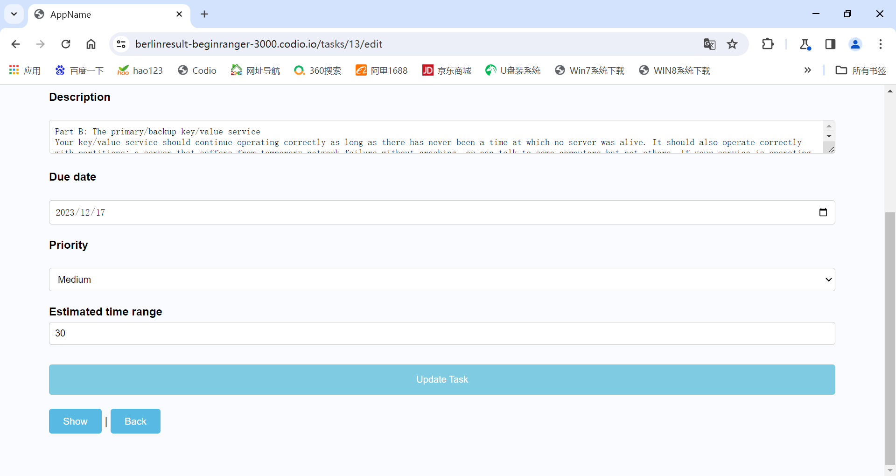

# Time Master: Master Your Time, Master Your Life

## Brief Introduction

In the fast-paced life, especially as Computer Science students at Columbia University, managing numerous deadlines and exams is challenging. Therefore, the risk of overlooking important tasks due to the sheer volume of responsibilities is high.

Time Master addresses this issue by offering timely reminders for assignments. The app allows users to input task details, including complexity and estimated completion time, aiding in prioritization and scheduling.

Users can mark tasks as urgent and update the app upon completing assignments or certain parts, ensuring consistent tracking of progress.

## Uniqueness of Our SAAS

Distinct from other products, Time Master enables users to define the complexity of tasks. It breaks down large projects into manageable segments, assigning deadlines to each part and crafting a personalized timeline.

The app prioritizes tasks, sends notifications for looming deadlines, and uniquely, allows users to visually mark tasks as high priority.
User Interface and Experience:

## Built with
+ Frontend
  - HTML/CSS
  - JavaScript
+ Backend
  - Ruby On Rails

## Overview of Code
The directory structure of our time master application:

  * app
    * assets
    * controllers
    * helpers
    * mailers
    * models
    * views
    * ...
  * bin
  * config
    * environments
    * initializers
    * locales
    * ...
  * coverage
  * db
  * features
  * lib
  * log
  * node_modules
  * public
  * script
  * spec
  * storage
  * test
  * tmp
  * vendor

## Screen Shots
### Login and SignUp

### Tasks Page

+ On this page, we can do the following things:
  - create new task by clicking the "New Task" button
  
  - explore the task's detail by clicking the "Show" button
  
  - edit the task's content by clicking the "Edit" button
  
  
  - delete the task by clicking the "Delete" button
  
  - Log out by clicking the "Log Out" button

## Instructions to run and test:
  1. Ruby Version Requirement: 2.6.6
  
  2. Run Cucumber and Rspec to test(Use commands: "rake cucumber" & "rake spec")

  3. Use "rails server -b 0.0.0.0" to run the server

  4. Heroku deployment link: https://evening-everglades-32169-3f2a9bf1ffd1.herokuapp.com/

  5. Youtube link: https://www.youtube.com/watch?v=Wb6Pyk28ZHs&feature=youtu.be
